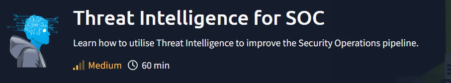

# Threat-Intelligence-for-SOC

 
  
 
 

In this room, we will highlight the impact of Threat Intelligence in the Security Operations pipeline; how important information shared across different groups can be utilised by your organisation. In addition, we will tackle topics such as the following throughout the room

Types of Threat Intelligence

Utilising Threat Intelligence to Prevent and Detect malicious activities

Threat Intelligence Consumers and Producers

 
  
 
 

